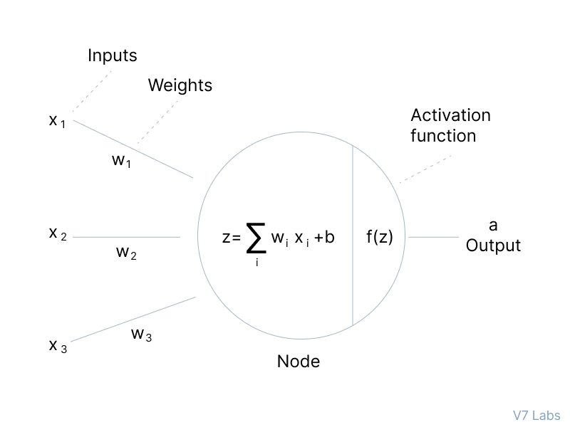
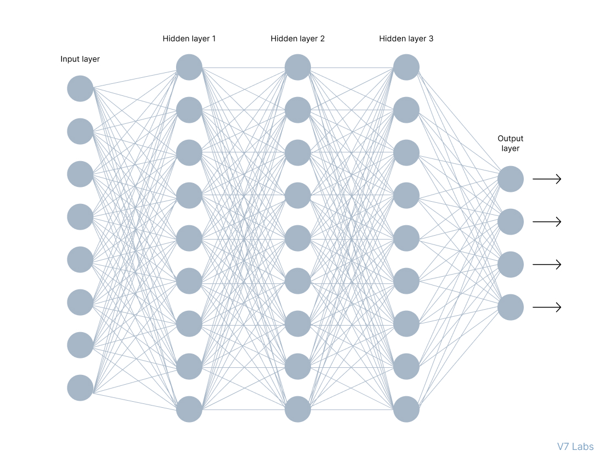

# Activation-Function for Deep Learning (Neural network).
### Assignment_01(Rifat Ahammed): Understanding and implementing the activation function. 
Throughout this article we will learn about Activation Functions with real life example and also get answer that why they are needed and what their types.

### Objective:
1. To comprehend the conceptual and mathematics underpinnings of the Activation Function.
2. To execute the Activation Function in a programming language (such as Python).
3. The objective is to examine the attributes and consequences of using the Activation Function
inside neural networks. 

## Theoretical Understanding:
  ### o Explain the Activation Function, including its equation and graph. 
  ### Activation fucntion: 
    
  An activation function in a neural network is a mathematical function applied to the output of a neuron or a layer of neurons. It determines the output or activation level of a neuron based on the weighted sum of its inputs. 
  The purpose of an activation function is to introduce non-linear transformations to the network’s computations. Without activation functions, the network would be limited to performing only linear transformations. 
  
  ### Equation:
  An activation function is typically represented by a function f(x) where x is the input
  to the neuron. Different activation functions have different equations. One commonly
  used activation function is the sigmoid function: 
   

  ### Graph:
  The sigmoid function graph is an S-shaped curve that smoothly transitions between 0 and 1 as the input varies from negative to positive infinity:
   
   

  ### o Discuss why activation functions are used in neural networks, focusing on the role of the Activation function. 
  
  ### Activation functions are used in neural networks for several reasons: 
  
  1. **Introducing non-linearity:** Without activation functions, neural networks would simply be a series of linear transformations. However, many real-world problems are inherently non-linear, and thus require non-linear transformations to be effectively modeled. Activation functions introduce non-linearity into the output of each neuron, allowing neural networks to model more complex relationships between inputs and outputs. 
  2. **Stabilizing gradients:** When training a neural network using backpropagation, the gradients can become unstable and either vanish or explode. Activation functions can help to stabilize the gradients and make training more efficient. 
  3. **Providing output range:** Activation functions can restrict the output of a neuron to a certain range, such as between 0 and 1 for the sigmoid function or between -1 and 1 for the tanh function. This can be useful for certain types of problems, such as binary classification or regression with outputs bounded by certain limits. 
  4. **Non-monotonic functions:**  Certain activation functions are non-monotonic, which means that they introduce local maxima and minima in the output of the neuron. This can help to prevent the network from getting stuck in local optima during training and improve its ability to find the global optimum. 

  ## Mathematical Exploration: 

  ### o Derive the Activation function formula and demonstrate its output range. 
  The primary role of the Activation Function is to transform the summed weighted input from the node into an output value to be fed to the next hidden layer or as output. 
    
  ### Elements of a Neural Networks Architecture:
    
  In the image above, you can see a neural network made of interconnected neurons. Each of them is characterized by its weight, bias, and activation function. 

  **Here are other elements of this network.** 

  **1. Input Layer:** The input layer takes raw input from the domain. No computation is performed at this layer. Nodes here just pass on the information (features) to the hidden layer. 

  **2. Hidden Layer:** As the name suggests, the nodes of this layer are not exposed. They provide an abstraction to the neural network. The hidden layer performs all kinds of computation on the features entered through the input layer and transfers the result to the output layer. 

  **3. Output Layer:** It’s the final layer of the network that brings the information learned through the hidden layer and delivers the final value as a result. 

  
  o Calculate the derivative of the Activation function and explain its significance in the backpropagation process. 
  ### Different kind of activation functions:

   There are several commonly used activation functions in neural networks, including: 

  1. **Sigmoid:** A sigmoid activation function maps any input to the range of 0 and 1, producing an output that can be interpreted as a probability. 
  2. **ReLU (Rectified Linear Unit):** The ReLU activation function sets any negative input to 0 and retains positive inputs unchanged. This function has become widely popular in deep learning due to its computational efficiency and ability to avoid the vanishing gradient problem. 
  3. **Tanh (Hyperbolic Tangent):** The Tanh activation function maps its inputs to the range of -1 and 1, producing outputs with zero mean and unit variance. This makes it useful for normalizing the output of a neuron, which can improve the performance of the network. 
  4. **Softmax:** Softmax activation is typically used as the final activation function in a neural network for multiclass classification problems. It maps its inputs to a probability distribution over multiple classes. 
  5. **Leaky ReLU:** It is similar to the ReLU function but allows a small gradient for negative inputs, preventing neurons from dying (example: outputting zero for all inputs). 
  6. **Swish:** Swish is a recent activation function that has been shown to outperform ReLU on some tasks. It is defined as x * sigmoid(x). 

 

