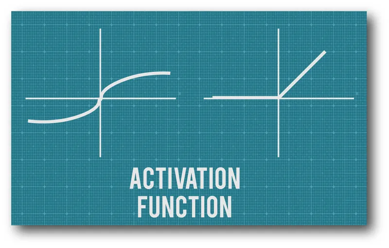
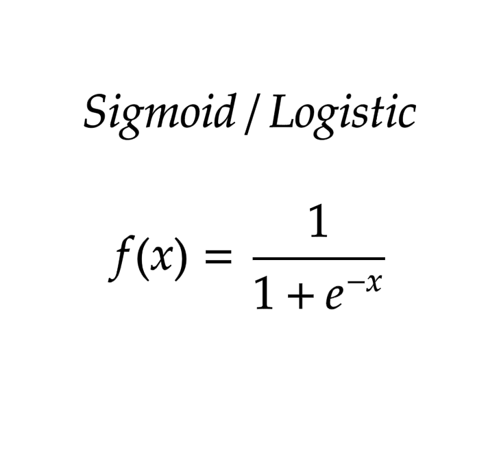

# Activation-Function (Assignment_01) for Deep Learning
Rifat_Assignment_01: Understanding and implementing the activation function. 
Throughout this article we will learn about Activation Functions with real life example and also get answer that why they are needed and what their types.

Objective:
1. To comprehend the conceptual and mathematics underpinnings of the Activation Function.
2. To execute the Activation Function in a programming language (such as Python).
3. The objective is to examine the attributes and consequences of using the Activation Function
inside neural networks. 

## Theoretical Understanding:
  ### o Explain the Activation Function, including its equation and graph. 
  ### 1. Activation fucntion: 
    
  An activation function in a neural network is a mathematical function applied to the output of a neuron or a layer of neurons. It determines the output or activation level of a neuron based on the weighted sum of its inputs. 
  The purpose of an activation function is to introduce non-linear transformations to the network’s computations. Without activation functions, the network would be limited to performing only linear transformations. 
  
  ### Equation:
  An activation function is typically represented by a function f(x) where x is the input
  to the neuron. Different activation functions have different equations. One commonly
  used activation function is the sigmoid function: 
   

  ### Different kind of activation functions:

   There are several commonly used activation functions in neural networks, including: 

  1. Sigmoid: A sigmoid activation function maps any input to the range of 0 and 1, producing an output that can be interpreted as a probability. 
  2. ReLU (Rectified Linear Unit): The ReLU activation function sets any negative input to 0 and retains positive inputs unchanged. This function has become widely popular in deep learning due to its computational efficiency and ability to avoid the vanishing gradient problem. 
  3. Tanh (Hyperbolic Tangent): The Tanh activation function maps its inputs to the range of -1 and 1, producing outputs with zero mean and unit variance. This makes it useful for normalizing the output of a neuron, which can improve the performance of the network. 
  4. Softmax: Softmax activation is typically used as the final activation function in a neural network for multiclass classification problems. It maps its inputs to a probability distribution over multiple classes. 
  5. Leaky ReLU: It is similar to the ReLU function but allows a small gradient for negative inputs, preventing neurons from dying (example: outputting zero for all inputs). 
  6. Swish: Swish is a recent activation function that has been shown to outperform ReLU on some tasks. It is defined as x * sigmoid(x). 

 

  ### o Discuss why activation functions are used in neural networks, focusing on the role of the Activation function. 
## Mathematical Exploration:
  o Derive the Activation function formula and demonstrate its output range. 
  o Calculate the derivative of the Activation function and explain its significance in the
backpropagation process. 
